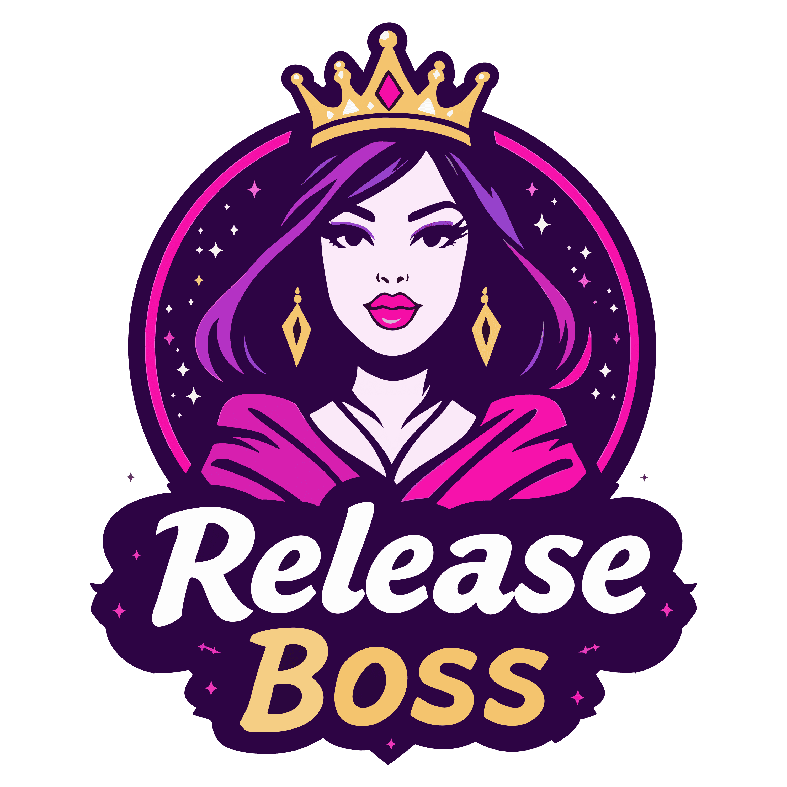

<div align="center">
  <br/>
  <b>She commits, she conquers, she releases</b>
</div>

# ✨ Release Boss ✨

I'm a super fabulous GitHub Action that makes releasing software as easy as saying "Git push!" 💅 I handle version bumps, changelogs, template processing, and create the cutest PRs you've ever seen - all from your conventional commits! I'm the LADY BOSS of releases! 👸👑

## 🌟 Overview

Release Boss is your new bestie for automating releases! She analyzes your conventional commits, figures out whether you need a patch, minor, or major version bump, updates all your version references, generates a gorgeous changelog, and wraps it all up in a tidy pull request. When merged, she handles tagging too! No more manual release stress - just commit, push, and let Release Boss work her magic!

## 💎 Features

- **Smart Version Bumping**: Automatically determines version bumps based on your conventional commits
- **Customizable Changelog Generation**: Creates beautiful changelogs organized exactly how you want them
- **PR-Based Changelog Tracking**: Maintains a structured changelog table in PR descriptions that's both machine-readable and human-editable
- **Template-Based Version Updates**: Updates version references in your files with a straightforward template system
- **PR Management**: Creates, updates, and tracks pull requests for your releases
- **Flexible Configuration**: Adapts to your workflow with extensive configuration options
- **Zero External Dependencies**: Everything's included - no need to install other packages

## 🚀 Getting Started

Add this sparkly workflow to your repository and watch the magic happen!

```yaml
name: Release Boss

on:
  workflow_dispatch:  # Manual trigger option
  push:
    branches:
      - main          # Your main development branch
  pull_request:
    branches:
      - release       # Your release branch
    types: [closed]   # Run when release PRs are merged

permissions:
  contents: write     # Needed for tagging
  pull-requests: write # Needed for PR creation/updates

jobs:
  release:
    runs-on: ubuntu-latest
    if: ${{ github.event_name == 'push' || (github.event_name == 'pull_request' && github.event.pull_request.merged == true) }}
    steps:
      - name: Checkout
        uses: actions/checkout@v3
        with:
          fetch-depth: 0  # Important: Fetch full history for accurate version bumping
      
      - name: Run Release Boss
        uses: atikayda/release-boss@v1    # Use just major version for stability
        # Other tag options:
        # uses: atikayda/release-boss@v1.2  # Lock to minor version
        # uses: atikayda/release-boss@v1.2.3  # Lock to exact version
        # uses: atikayda/release-boss@latest  # Live dangerously with latest
        with:
          token: ${{ secrets.GITHUB_TOKEN }}
          config-file: .release-boss.yml
```

## 📚 Using a Personal Access Token

A github token (GITHUB_TOKEN) cannot recursively trigger workflows, so if you rely on a following workflow (to build and publish on tag for example), you will need to use a fine-grained personal access token instead.

You can create a fine-grained personal access token here:
  https://github.com/settings/personal-access-tokens

When you create the token, make sure you select the correct Resource owner (eg. the organisation you want the token to be scoped to), repository scope, expiry duration and the following permissions:

- Metadata: Read access
- Actions: Read-write access
- Code: Read-write access
- Issues: Read-write access
- Pull requests: Read-write access

Copy the generated token and add it to your repository secrets as (for example) `RELEASER_TOKEN`.

```yaml
jobs:
  release:
    steps:
      # Your existing steps…
      - name: Run Release Boss
        uses: atikayda/release-boss@latest
        with:
          token: ${{ secrets.RELEASER_TOKEN }} # Add your token secret name here
```

## ⚙️ Configuration

Release Boss now supports both YAML and JSON configuration! 💁‍♀️

### YAML Configuration (Recommended for GitHub Users)

Create a `.release-boss.yml` file in your repository root. YAML is more GitHub-friendly and allows comments!

```yaml
# ✨ Release Boss Configuration ✨

# Branch Configuration
mergeBranch: main           # Branch to analyze commits from
stagingBranch: staging      # Branch prefix for staging changes
releaseBranch: release      # Branch to create PR against
deleteStagingBranch: true   # Whether to delete staging branches after PR is merged/closed

# PR Configuration
pullRequestTitle: "chore: release ✨ {version} ✨"  # PR title template
pullRequestHeader: "# 🎉 Release Time! 💃"          # Header for PR description

# Files to update
templateFiles:              # Files containing whole-file templates
  - path: package.tpl.json  # Template file path
    output: package.json    # Output file path

versionFiles:              # Files containing inline version templates
  - src/version.js         # Files with %%release-boss: ... %% markers

# Changelog Configuration
changelogSections:          # Commit types to include in changelog
  - type: feat
    section: "✨ Fabulous New Features ✨"
    hidden: false
  - type: fix
    section: "🛠️ Bug Fixes & Polish 💅"
    hidden: false
  - type: perf
    section: "⚡ Performance Slayage 🔥"
    hidden: false

changelogPath: CHANGELOG.md # Path to changelog file

# PR-Based Changelog Table Configuration
changelogTable:
  enabled: true             # Enable the PR-based changelog table
  markers:                  # HTML comment markers to identify the table
    start: "<!-- RELEASE_BOSS_CHANGELOG_START -->"
    end: "<!-- RELEASE_BOSS_CHANGELOG_END -->"
  columns:                  # Table columns configuration
    - name: "Type"
      field: "type"
    - name: "Scope"
      field: "scope"
    - name: "Description"
      field: "description"
    - name: "PR"
      field: "pr"
    - name: "Commit"
      field: "commit"
    - name: "Author"
      field: "author"

# Tagging Configuration
versionTagPrefix: true      # Whether to prefix tags with 'v' (v1.0.0)
tagLatest: true             # Also tag as 'latest'
tagMajor: true              # Also tag with major version (v1)
tagMinor: true              # Also tag with major.minor (v1.2)
```

### JSON Configuration (Traditional)

If you prefer JSON, create a `.release-boss.json` file instead:

```json5
{
  "mergeBranch": "main",                   // Branch to analyze commits from
  "stagingBranch": "staging",               // Branch prefix for staging changes
  "releaseBranch": "release",               // Branch to create PR against
  "deleteStagingBranch": true,              // Whether to delete staging branches after PR is merged/closed
  "pullRequestTitle": "chore: release ✨ {version} ✨", // PR title template
  "pullRequestHeader": "# 🎉 Release Time! 💃",     // Header text for PR description
  "templateFiles": [                       // Files containing whole-file templates
    "package.tpl.json"                     // Will be processed into package.json
  ],
  "versionFiles": [                        // Files containing inline version templates
    "version.go"                           // Files with %%release-boss: ... %% markers
  ],
  "changelogSections": [                  // Commit types to include in changelog
    {"type": "feat", "section": "✨ Fabulous New Features ✨", "hidden": false},
    {"type": "fix", "section": "🛠️ Bug Fixes & Polish 💅", "hidden": false},
    {"type": "perf", "section": "⚡ Performance Slayage 🔥", "hidden": false},
    {"type": "refactor", "section": "💃 Code Makeovers 💋", "hidden": false},
    {"type": "docs", "section": "📝 Documentation Glow-Ups 📚", "hidden": false}
  ],
  "changelogPath": "CHANGELOG.md",        // Path to changelog file
  "versionTagPrefix": true,               // Whether to prefix tags with 'v' (v1.0.0)
  "tagLatest": true,                      // Also tag as 'latest'
  "tagMajor": true,                       // Also tag with major version (v1)
  "tagMinor": true                        // Also tag with major.minor (v1.2)
}
```

## 💅 Template Syntax

Release Boss uses a delightfully simple template system to update version references in your files. There are two ways to use it:

### 1️⃣ Inline Templates (for version files)

Add template markers to your code files to tell Release Boss where to update versions, and add it to the `versionFiles` array in your config:

```go
// version.go example
package main

// Version represents the current version of the package.
// %%release-boss: const Version = "v{{version}}"%%
const Version = "v1.0.0"
```

Or for multi-line templates:

```js
/* %%release-boss:
const VERSION = {
  full: '{{version}}',
  major: {{major}},
  minor: {{minor}},
  patch: {{patch}}
};
%% */
const VERSION = {
  full: '1.2.3',
  major: 1,
  minor: 2,
  patch: 3
};
```

### 2️⃣ Whole-File Templates (for template files)

Create a template file with `.tpl` in the filename, like `package.tpl.json` and add it to the `templateFiles` array in your config:

```json
{
  "name": "my-awesome-package",
  "version": "{{version}}",
  "description": "Package version {{version}} with major {{major}}",
  "main": "index.js"
}
```

Release Boss will process this into `package.json` with the correct version values! 💁‍♀️

### 3️⃣ Line-based Search and Replace (for update files)

For files where you need to find and replace specific lines (like when you can't add template markers), use the `updateFiles` feature:

```yaml
updateFiles:
  - file: src/version.go
    findLine: "const Version = "
    replaceLine: "const Version = \"v{{version}}\""
  - file: package.json
    findLine: "  \"version\": "
    replaceLine: "  \"version\": \"{{version}}\","
```

This will search for lines containing the `findLine` text and replace them with the `replaceLine` template. Super handy for files where you can't add template markers or when working with external tools that have specific formatting requirements! 💅

## 🔮 Version Bumping Rules

Release Boss is a mind reader when it comes to figuring out which version number to bump! It follows conventional commits to determine if you need a patch, minor, or major release:

- **Major Version Bump** (Breaking changes!)
  - Commits with `BREAKING CHANGE:` in the body
  - Commits with `!` after the type/scope (like `feat!:`)

- **Minor Version Bump** (New fabulous features)
  - `feat`: New features that don't break anything

- **Patch Version Bump** (Little touch-ups)
  - `fix`: Bug fixes
  - `perf`: Performance improvements
  - `refactor`: Code changes that don't add features or fix bugs

- **No Version Bump** (Keeping things tidy)
  - `docs`: Documentation only changes
  - `style`: Code style/formatting changes
  - `test`: Adding or fixing tests
  - `ci`: Changes to CI configuration
  - `build`: Changes to build system

### ✨ Special Rules for Pre-1.0 Versions

For those projects still finding their way:
- Pre-1.0 breaking changes bump the **minor** version
- Pre-1.0 features bump the **patch** version

## 💻 Example Workflows

### Basic Workflow

1. Make commits using conventional commit format like:
   ```
   feat: add sparkly new login screen
   fix: prevent users from clicking too many times
   docs: update the README with more emojis
   ```

2. Push (or make a Pull Request) to your main branch
3. Release Boss creates a staging branch and a PR to your release branch
4. Review the gorgeous changelog and version updates
5. Merge the PR when you're ready to release
6. Release Boss tags the release for you
7. If you're not quite ready to release just yet, just let it ride! Release Boss will update your PR as new commits come in, and continue tracking the next version.

### Template Processing Flow

1. Create version files with inline templates:
   ```js
   // %%release-boss: const VERSION = "{{version}}"%%
   const VERSION = "1.0.0";
   ```

2. Create template files with `.tpl` extension:
   ```
   my-config.tpl.json → processed to → my-config.json
   ```

3. Configure which files to process in `.release-boss.yml` or `.release-boss.json`
4. Push changes and let Release Boss handle the rest!

## 🔄 Release Workflow

Release Boss follows a fabulous GitFlow-inspired approach to make your releases absolutely flawless! 👑

### How It Works

1. **Starting Point**: When it's time for a release, Release Boss creates a staging branch from your release branch (not main!) to ensure stability
2. **Feature Integration**: She then merges your main branch into this staging branch to bring in all your gorgeous new features
3. **Version Magic**: After the merge, she updates version files and generates a stunning changelog based on what's in the staging branch
4. **PR Creation**: A pull request is created from staging → release branch for your review
5. **Tagging Time**: When you merge the PR, she automatically creates version tags with optional major/minor aliases
6. **Cleanup**: After the PR is merged or closed, she'll tidy up by deleting the staging branch (configurable)

This GitFlow-based approach gives you:
- 💎 Cleaner merge history
- 🛡️ Protection against conflicts
- 🔍 Better visibility into what's being released
- 🧩 Proper separation between development and releases

## 💡 Tips & Tricks

- **Preview Version Bumps**: Need to know what version will be next? Look at the PR title!
- **Skip Releasing**: Add `[skip release]` to your commit message to prevent triggering the workflow
- **Force Version**: To override the calculated version, adjust your PR title manually
- **Super Bump Commands**: Add a comment with `/bump minor` or `/bump major` to your PR to force a prettier version number!
- **Debug Issues**: Check the GitHub Actions logs for detailed diagnostics

### ✨ Super Bump Commands ✨

Sometimes a girl needs to skip ahead to the next minor or major version for a really special release! You can force Release Boss to bump your version by adding a special command in a PR comment:

```
/bump minor   # Takes v1.0.22 → v1.1.0 (only if not already at a .0 patch)
/bump major   # Takes v1.2.3 → v2.0.0 (only if not already at .0.0 minor.patch)
```

These commands are super smart! They won't do anything if your version is already at the level you're asking for. For example, if you're releasing v1.1.0 and comment `/bump minor`, it won't change because you're already at a minor version bump!

## 💪 Contributing

I welcome contributions! Feel free to open issues and PRs to make me even more fabulous! 🎉

## License

GPLv3, honey, OFC! 💜
